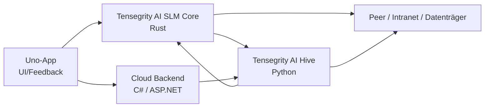

# Komponenten- und Architektur-Design (Phase 2)

## 1. Ziel

Dieses Dokument übersetzt die Anforderungen aus dem Lasten- und Pflichtenheft und die Protobuf-Contracts in ein implementierbares Architekturdesign für die ersten verifizierbaren Sprint-Phasen. Es dient als Designbasis für Core, Hive, Cloud-Backend und Uno-App.

## 2. Designprinzipien

- Single Source of Truth: Protobuf-Contracts in `proto_restatify-tensegrity-ai`.
- Keine Rohdaten im Hive: nur gefaltete Deltas, Metadaten und Strukturmeldungen.
- Lokale Priorität: Geräte entscheiden lokal über Stufe, Privatsphäre und lokale Sicherheitsgrenzen.
- Vertrauensgewichtung: der Hive wertet App-, Geräte- und Slot-Trust in der Aggregation aus.
- Signierte Distribution: Releases und Delta-Pakete müssen Version, Hash und Signatur prüfen.

## 3. Komponentendiagramm

## 4. Verantwortlichkeiten je Komponente

### 4.1 Core (Rust)

**Ziel:** lokale Entscheidungs- und Lernlogik auf dem Gerät.

**Kernmodule**

- `tg-policy`
  - Modelliert `ConfidentialityLevel` und Berechtigungsmaske.
  - Implementiert Taint-Regel (`max(levels)`).
  - Blockiert `Streng geheim` und `Nur lokal` im Browser-Client.
- `tg-fold`
  - Clipping, Kompression, DP-Rauschen nach Stufe.
  - `NUR_LOKAL` erzeugt 0 Byte Netzwerkverkehr.
  - `STRENG_GEHEIM` erzeugt nur Strukturmeldung.
- `tg-learn`
  - maskierte Aktualisierung von `W_logik` und `W_PI`.
  - nur LoRA-Adapter, niemals Basisgewichte.
- `tg-sync`
  - formatiert `DeltaSubmission` und `UpdateRequest`.
  - prüft Signatur, Hash und angeforderten Versionsstand.
- `tg-p2p`
  - Peer-Transport für `exchange` und signierte Paket-Distribution.

**Implementierungsregeln**

- Keine Rohdaten verlassen das Gerät.
- Alle Einreichungen müssen ein gültiges `TraceContext` und eine definierte Stufe mitbringen.
- `NUR_LOKAL` ist ein hard stop für Transport.

### 4.2 Hive (Python)

**Ziel:** Aggregation, Trust und Release-Verteilung.

**Kernmodule**

- `trust-service`
  - prüft App-ID, Gerät, Signatur und Trust-Score.
  - verwirft `T(a) = 0` automatisch.
- `aggregation-service`
  - wendet `T(a)` als Gewicht für FedAvg-ähnliche Webung an.
  - prüft Fachgebiet, Slot und Kategorie.
- `slot-registry`
  - verwaltet Slots, Kategorien, Rang und Lebenszyklus.
  - wird als Source of Truth für Experten- und Router-Auswahl benutzt.
  - lehnt unbekannte oder inaktive Slots ab und bleibt mit der Vertraulichkeitsstufe konsistent.
- `release-service`
  - signierte Releases mit `ReleaseBundle`.
  - prüft Hash, Version und Signatur vor Verteilung.
- `audit-log`
  - protokolliert blockierte Einreichungen, signaturfehler und Policy-Verstöße.

**Implementierungsregeln**

- Der Hive nimmt keine Rohdaten an.
- Jede Einreichung muss eine validierte Stufe und eine gültige `signature` haben.
- `Streng geheim`-Einreichungen dürfen nur strukturierte Metadaten enthalten.

### 4.3 Cloud-Backend (C# / ASP.NET)

**Ziel:** Inferenz- und Routing-Services für WebAssembly und Cloud-Fallback.

**Kernmodule**

- `Gateway` mit gRPC-Web / OIDC
- `Router`
  - Generalist zuerst, dann Experten nach Slot-/Kategorie-Selektierung.
- `InferenceService`
  - nutzt Generalist-SLM und Multi-LoRA-Experten.
- `PolicyGuard`
  - blockiert `STRENG_GEHEIM` und `NUR_LOKAL` im Browser-Client.

**Implementierungsregeln**

- Browser-Client darf nur nicht-strenge Stufen nutzen.
- Feedback-Events gehen an den Hive, sofern die Nutzerfreigabe besteht.
- Cloud darf nur verwendet werden, wenn die Policy dafür erlaubt.

### 4.4 Uno-App

**Ziel:** lokale Darstellung, Feedback, Stufenauswahl und Benutzermetadaten. 

**Kernbereiche**

- `Policy UI` für Auswahl der Stufe im Kontext.
- `Feedback UI` mit Daumen hoch/runter, Belegen und Erklärungen.
- `Local Sync Manager` für Update-Requests und Paket-Download.
- `Device Trust Context` für App-ID, Device-ID und Plattform.

**Implementierungsregeln**

- Keine direkte rohe Wissensfreigabe bei `STRENG_GEHEIM`.
- Der Nutzer sieht die Stufe und die Konsequenz der Freigabe.
- Die UI zeigt nur erlaubte Cloud-/Inferenz-Pfade an.

## 5. Datenflüsse

### 5.1 Gerät → Hive

1. Gerät trainiert lokal (LoRA-Adapter, maskierte Aktualisierung).
2. `tg-fold` produziert je nach Stufe eine Nutzlast.
3. `tg-sync` erzeugt `DeltaSubmission`.
4. Hive prüft Trust, Stufe, Signatur und Slot.
5. Aggregation erfolgt mit `T(a)` als Gewicht.

### 5.2 Hive → Gerät

1. Slot-Registry und Release-Service erzeugen signierte Slots/Updates.
2. Geräte senden `UpdateRequest`.
3. Release-Paket wird validiert und installiert.
4. Bei `Streng geheim`-Slots gilt ein lokales Prüf-Gate.

### 5.3 Browser / WASM → Cloud

1. App sendet nur erlaubte Anfragen.
2. Cloud-Backend prüft Policy und Routing.
3. Inferenz verwendet Generalist + Experten.
4. Feedback wird an den Hive weitergeleitet.

## 6. Schnittstellenabgleich

| Bereich | Vertragsquelle | Typ | Ziel |
|---|---|---|---|
| gemeinsame Typen | `common.proto` | enum + messages | Core/Hive/Cloud/App |
| Inferenz | `inference.proto` | request/response/service | App ↔ Cloud |
| Feedback | `feedback.proto` | event/ack | App/Cloud ↔ Hive |
| Delta-Einreichung | `federation.proto` | submission/ack | Core ↔ Hive |
| Release | `release.proto` | request/bundle/ack | Hive ↔ Core |
| Trust / Slots | `admin.proto` | policy/registration | Admin ↔ Hive |
| Hive-Exchange | `exchange.proto` | export/import | Hive ↔ Hive/Klon |

## 7. Erste technische Prioritäten für Phase 2

1. Implementierung von `tg-policy` mit Taint- und Berechtigungslogik.
2. `tg-fold` mit Clipping und DP-Null-Pfad für `NUR_LOKAL`.
3. `DeltaSubmission` und `ReleaseBundle` in den Konsumenten verifizieren.
4. Trust- und Slot-Registry im Hive minimal umsetzen.
5. App-Policy für WASM-Blockaden umsetzen.
6. Lokale Infrastruktur für Integrationstests aufsetzen: Cloud und Hive als lokale Services mit Smoke-Tests.

## 8. Verifikationsstrategie

- Unit-Test: `tg-policy`, `tg-fold`, Taint-Regeln.
- Komponententest: Submission/Release-Validierung ohne echtes Netzwerk.
- Integrationstest: gRPC / protobuf Roundtrip zwischen Core und Hive.
- Systemtest: 0-Byte- und Signatur-Validierung für `NUR_LOKAL` und `STRANG_GEHEIM`.

## 9. Abschluss

Dieses Design ist die erste technisch umsetzbare Übersetzung aus Lastenheft, Pflichtenheft und Protobuf-Contracts. Es bildet die Grundlage für die erste implementierende Phase, bevor die erste produktive Version als Releasesystem ausgebaut wird.
