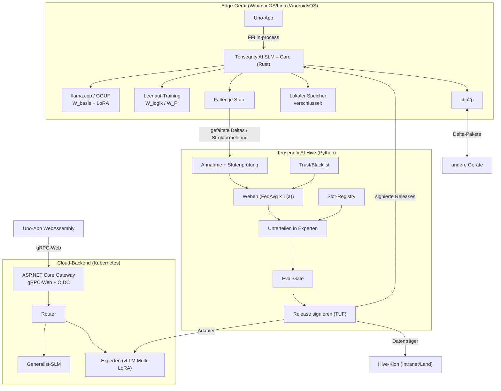

# Tensegrity AI – Ökosystem-Beschreibung mit Technologien

*Version 2.0 – Stand: 2026-10-01 (ersetzt Version 1.0 vom Juni 2026)*

Grundlage: [Whitepaper V1.0.26](../whitepaper/tensegrity-ai-whitepaper-v1.0.26.md). Bei Widersprüchen gilt das Whitepaper.

## Inhaltsverzeichnis

1. [Einleitung](#1-einleitung)
2. [Systemkomponenten und Repositories](#2-systemkomponenten-und-repositories)
3. [Architektur-Übersicht](#3-architektur-übersicht)
4. [Technologie-Stack pro Komponente](#4-technologie-stack-pro-komponente)
5. [Vertraulichkeitsstufen](#5-vertraulichkeitsstufen)
6. [Datenflüsse](#6-datenflüsse)
7. [Update-System](#7-update-system)
8. [Plattformstrategie und Performance](#8-plattformstrategie-und-performance)
9. [USPs und technische Umsetzung](#9-usps-und-technische-umsetzung)
10. [Änderungen gegenüber Version 1.0](#10-änderungen-gegenüber-version-10)

---

## 1. Einleitung

Tensegrity AI ist ein föderiertes KI-System: Lokale Small Language Models (SLMs) auf Edge-Geräten lernen aus der
Nutzung, falten ihre Lern-Deltas je nach Vertraulichkeitsstufe und reichen sie bei einem **Hive** ein. Der Hive webt
die Deltas vertrauensgewichtet zusammen, unterteilt sie in Fachgebiets-Experten und verteilt signierte Releases über
Hive, P2P-Mesh und Datenträger zurück.

Das Projekt ist Open Source unter **Apache License 2.0**.

**Zielgruppe:** Entwickler (Rust, Python, C#/.NET, Uno Platform), Architekten, Betreiber von Hives, Beitragende.

## 2. Systemkomponenten und Repositories

| Komponente | Rolle | Sprache | Repository |
|---|---|---|---|
| Dokumentation | Whitepaper, Anforderungen, Architektur, ADRs, Testplan, Backlog | Markdown | `docs_restatify-tensegrity-ai` |
| Schnittstellen | Protobuf-Contracts `tensegrity.v1` | Protobuf | `proto_restatify-tensegrity-ai` |
| **Tensegrity AI SLM – Core** | Edge-Kern: Inferenz, Experten-Router, Lernen, Falten, Update, P2P | Rust | `core_restatify-tensegrity-ai-slm` |
| **Tensegrity AI Hive** | Weben, Unterteilen, Eval-Gate, Release, Rollen Root/Klon | Python | `api_restatify-tensegrity-ai-hive` |
| **Cloud-Backend** | SLM-Microservices (Generalist + Experten) für Web/WASM | C# + vLLM | `api_restatify-tensegrity-ai-cloud` |
| **Restatify – Tensegrity AI** | Eine Uno-App für Windows, macOS, Linux, Android, iOS und WebAssembly | C# / Uno | `app_restatify-tensegrity-ai` |

Alle Repositories liegen unter `github.com/carryman1979`.

## 3. Architektur-Übersicht

Diagramme: [architecture.mmd](architecture.mmd) (Komponenten) und [sequence.mmd](sequence.mmd) (Lernzyklus).

## 4. Technologie-Stack pro Komponente

### 4.1 Tensegrity AI SLM – Core (Rust)

| Crate | Aufgabe | Technologie |
|---|---|---|
| `tg-model` | Inferenz, LoRA-Hot-Swap | llama.cpp (GGUF Q4, Vulkan/Metal/CPU) über Rust-Bindings |
| `tg-experts` | Router und Experten-Auswahl | kleines Klassifikationsmodell, Slot-Registry-Spiegel |
| `tg-signals` | Feedback: Daumen hoch/runter, Korrektur mit Beleg, positive Rückmeldung | Event-Log |
| `tg-verify` | Prüfung neuer Informationen gegen Experten | lokal / Cloud (nur Offen/Vertraulich) |
| `tg-learn` | Leerlauf-LoRA-Training, maskierte Gradienten | Spike S2: candle / llama.cpp finetune / ONNX Runtime Training |
| `tg-policy` | Stufen, Bitmaske, Taint | reine Logik, property-getestet |
| `tg-vault` | verschlüsselter lokaler Speicher, W_PI | SQLite/RocksDB + Plattform-Keystore |
| `tg-fold` | Clipping, Kompression, Gauß-Rauschen, Privacy Accountant | — |
| `tg-sync` | Update-Request, Delta-Pakete, TUF-Prüfung, Rollback | — |
| `tg-p2p` | Mesh, Paketaustausch | libp2p (QUIC, Noise, Kademlia, Relay) |
| `tg-ffi` | Brücke zur Uno-App | uniffi-bindgen-cs bzw. csbindgen (iOS erlaubt keinen Daemon → in-process) |
| `relay` | P2P-Relay-Dienst | libp2p circuit relay |

### 4.2 Tensegrity AI Hive (Python)

| Schicht | Technologie |
|---|---|
| API | gRPC (`tensegrity.v1.federation`, `release`, `admin`, `exchange`) |
| Weben/Training | PyTorch, PEFT, TRL |
| Export | Konvertierung der Adapter nach GGUF für Geräte |
| Daten | PostgreSQL (Metadaten, Trust, Registry), MinIO/S3 (Adapter, Releases) |
| Signatur | TUF-Rollen, Offline-Root-Schlüssel |
| Betrieb | Docker Compose (auch air-gapped mit GPU), Helm für Kubernetes |
| Rollen | Root/Upstream oder Klon – per Konfiguration, Vertrauensanker konfigurierbar |

### 4.3 Cloud-Backend (C# + vLLM)

| Schicht | Technologie |
|---|---|
| Gateway | ASP.NET Core, gRPC + gRPC-Web direkt (kein Envoy nötig) |
| Identität | OIDC; Standard-Broker Keycloak (Social Login Google/Microsoft/Apple/Facebook), Auth0 per Konfiguration, Intranet eigener IdP |
| Inferenz | vLLM mit Multi-LoRA: Generalist + Experten-Adapter |
| Routing | Generalist zuerst, Router wählt Experten |
| Hosting | Kubernetes (Helm), Auslieferung der WASM-App |

### 4.4 Restatify – Tensegrity AI (Uno Platform)

- Eine Codebasis, Skia-Renderer, Zielplattformen Windows, macOS, Linux, Android, iOS und WebAssembly.
- Native Plattformen: Core über FFI im selben Prozess.
- WebAssembly: Inferenz über das Cloud-Backend; Stufen „Streng geheim“ und „Nur lokal“ sind gesperrt.
- MVUX, Navigation-Extensions, Material-Theme, Lokalisierung.

## 5. Vertraulichkeitsstufen

| Stufe | Was verlässt das Gerät | Hive | Nutzen |
|---|---|---|---|
| Offen | komprimiertes Delta | webt sofort mit T(a) | Trend-Themen, schnelles Lernen |
| Vertraulich | komprimiertes Delta + Rauschen ((ε, δ)-DP) | webt mit T(a) | Lernen mit Privatsphäre |
| Streng geheim | nur Strukturmeldung (grobe Kategorie, gebündelt, mit App-ID) | Null-Slot ab k_min Meldern | Geheimes Wissen bleibt lokal, profitiert aber von gemeinsamen Updates |
| Nur lokal | nichts | — | vollständige Isolation |

Berechtigungsmaske (Bits 0–5), Taint-Regel und Formeln: Whitepaper Abschnitt 2.

## 6. Datenflüsse

### 6.1 Lernzyklus Gerät → Hive

1. Nutzung erzeugt Signale (Feedback, Korrekturen, bestätigte neue Informationen).
2. Im Leerlauf trainiert `tg-learn` maskiert: Streng geheim/Nur lokal → W_PI, sonst W_logik.
3. `tg-fold` faltet je Stufe, `tg-sync` reicht signiert ein (online, P2P-Relay oder Datenträger).
4. Hive prüft Stufe und App-ID, webt, unterteilt, prüft im Eval-Gate und signiert ein Release.

### 6.2 Inferenz nativ

UI → Core → Router → Basis + Experten-Adapter → Antwort (offline möglich). Cloud-Experten nur bei Offen/Vertraulich
und Nutzerfreigabe (Bit 4).

### 6.3 Inferenz WebAssembly

Browser → Gateway (gRPC-Web, OIDC) → Router → Generalist/Experte (vLLM) → Antwort. Feedback geht als Signal an den
Hive (nur Offen/Vertraulich).

## 7. Update-System

### 7.1 Hive → Gerät/P2P

- Releases sind inhaltsadressiert und TUF-signiert; Geräte prüfen Signatur, Version (kein Downgrade) und Hash.
- Gerät sendet Update-Request mit Versionsstand → Lücke → Delta-Paket mit den geänderten Slots.
- Pakete verbreiten sich über libp2p; jeder Peer prüft dieselben Signaturen. Datenträger-Import nutzt dasselbe Format.
- Offen/Vertraulich: direkte Übernahme. Streng-geheim-Slots: lokales Prüf-Gate mit Vorschlag und Rollback.

### 7.2 Gerät → Hive

- Einreichungen sind signiert, enthalten Stufe, App-ID und den Stand des Privacy Accountants.
- „Nur lokal“ erzeugt 0 Byte. Streng geheim sendet nur gebündelte Strukturmeldungen.

### 7.3 Hive-Kaskaden

Internet-Hive (Root) → Klone (Organisation, Intranet, Land). Klone prüfen Upstream-Signaturen und signieren lokal neu.
Intranet-Hives sind strikt getrennt: Import per Datenträger, Export optional per Richtlinie, nie Streng geheim.

## 8. Plattformstrategie und Performance

| Ziel | Vorgabe |
|---|---|
| Mobilgeräte | 6–8 GB RAM, Basismodell ≤ ca. 2 B Parameter in Q4 (z. B. Qwen3-1.7B, SmolLM3, Phi-mini; Lizenz Apache/MIT) |
| Kaltstart | Modell per mmap, Adapter lazy laden |
| Training | nur im Leerlauf (Laden, Akku, Temperatur), sonst Desktop im LAN |
| GPU | Vulkan (Android/Windows/Linux), Metal (iOS/macOS), CPU-Fallback |
| Speicher | Adapter klein halten (Rang 8–16), Ablauf/Archiv langfristig (BL-005) |

## 9. USPs und technische Umsetzung

| USP | Umsetzung |
|---|---|
| Datensouveränität mit vier Stufen | `tg-policy`, `tg-fold`, Stufenprüfung im Hive |
| Streng geheim mit gemeinsamer Lernwirkung | Null-Slots, Slot-Registry, lokales Prüf-Gate |
| Offline-First | lokale Inferenz und Training, Datenträger-Updates |
| Dezentrale Verteilung | libp2p-Mesh mit TUF-signierten Delta-Paketen |
| Vertrauensbasiertes Lernen | T(a), Betreiberfaktor, Blacklist, Eval-Gate |
| Souveräne Betreiber | Hive-Klone mit eigenen Vertrauensankern |
| Web ohne Installation | Uno WebAssembly + Cloud-Backend |

## 10. Änderungen gegenüber Version 1.0

| Version 1.0 | Version 2.0 | Grund |
|---|---|---|
| Hive hostet großes LLM (70B) und trainiert | Hive webt nur Deltas; großes Modell entfällt, Web-Inferenz im separaten Cloud-Backend | Whitepaper: Hive trainiert nicht |
| Rust-Hive mit tch-rs | Hive in Python (PyTorch/PEFT) | ML-Ökosystem |
| Edge mit tch-rs/PyTorch/ONNX, Phi-2/TinyLlama | llama.cpp/GGUF, aktuelle SLMs ≤ 2B | Mobil-Performance |
| Uno ↔ Rust per gRPC über TCP/Unix-Socket | FFI im selben Prozess | iOS erlaubt keinen Daemon |
| Envoy für gRPC-Web, SignalR | ASP.NET Core gRPC-Web direkt | weniger Komponenten |
| Blazor/React-Showcase | Uno-App als WebAssembly | eine Codebasis |
| Bitflag Streng vertraulich ja/nein | vier Stufen + Berechtigungsmaske | Whitepaper V1.0.26 |
| Kein Update-Konzept | TUF-Releases, Delta-Pakete, P2P, Kaskaden | Kernanforderung |
